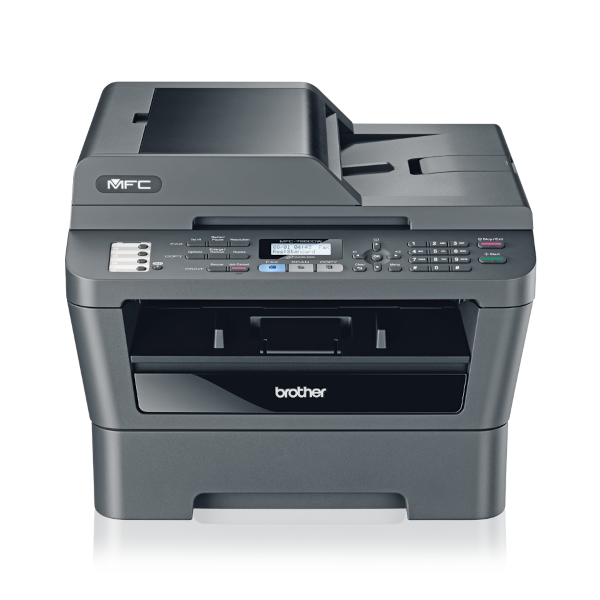

# Brother MFC-7860DW Printer/Scanner Setup

I have a printer/scanner, the Brother MFC-7860DW. I bought it 2011-08-28 and its a trusty piece
of hardware that I want to use for years to come.

In this repository, I document some aspects of setting it up in a way I like.

## Scanning

See [Scanning](docs/scanning.md).

## Printing

See [Printing](docs/printing.md).
