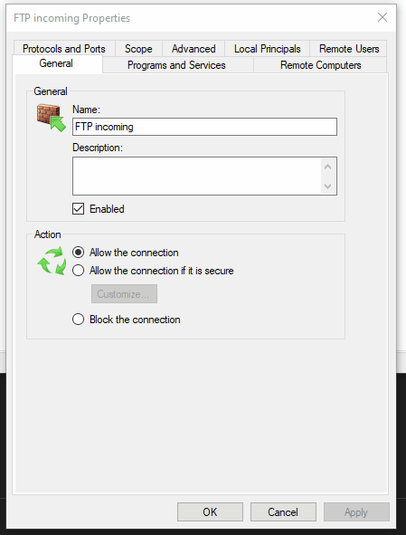
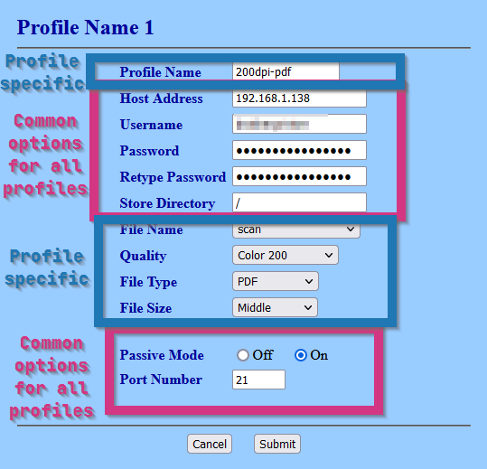

# Brother MFC-7860DW Printer FTP Server

Run an FTP server as a Docker Compose service that is connectable from my printer, a Brother
MFC-7860DW. This printer is quite old but does support FTP transfer of scans. As far as I can tell,
this is the best way to get scans off of it.

*Note: The server is based off of
[docker-vsftpd.git](https://github.com/markhobson/docker-vsftpd.git)
but has been edited so that I don't have to commit the secret to version control in the
`docker-compose.yml` file (and to provide some other quality-of-life changes).*

## Steps

1. Get the git submodule that contains the dockerized vsftpd:

   ```shell
   git submodule init
   git submodule update
   ```

2. Save the username and password of the FTP server in a file in the build context of the server
   image:

   *Note: I save these in my password manager.*

   ```shell
   cp docker-vsftpd/virtual_users.template.txt docker-vsftpd/virtual_users.txt
   vi docker-vsftpd/virtual_users.txt
   ```

3. Ensure the volume bind source in `docker-compose.yml` exists. Default is
   `C:\Users\tim\Desktop\scans`. Update it if not.

4. Run this docker compose service:

   ```shell
   docker compose up --detach --build --always-recreate-deps  # or simply `make up` if you have make
   ```

5. Create a firewall rule like the following:

   

   The main parts are:

   - Protocols and Ports tab
      - Protocols and Ports section
         - Local port: `Specific Ports` and `20, 21, 21100-21110`
           (20 is for FTP data, 21 is for FTP control, 21100-21110 are for passive mode.)
   - Scope tab
      - Remote IP address section
         - `These IP addresses:`
            - `192.168.1.0/24`, or whatever an appropriate CIDR subnet block would be for you.

6. Find the printer's IP address on the network, and navigate to it in a web browser. In the menu,
   go to:

   1. Administrator Settings
   2. FTP Scan Profile

   *Note: If the administrator username/password are asked for, look for it in my password manager.*

   Then, create a few profiles.

   

   Common Parameters:

   - Host Address: IP of my computer
   - Username: username from step #1
   - Password: password from step #1
   - Store Directory: `/`
   - Passive Mode: `On`
   - Port Number: `21`

   Profile-specific Parameters:

   - Document scanning:
     - Profile Name: `document`
     - File Name: `scan`
     - Quality: `Color 200`
     - File Type: `PDF`
     - File Size: `Middle`

   - Hi-Res Document scanning:
     - Profile Name: `document-hi-res`
     - File Name: `scan`
     - Quality: `Color 600`
     - File Type: `PDF`
     - File Size: `Large`

   - Photo scanning:
     - Profile Name: `photo`
     - File Name: `scan`
     - Quality: `Color 600`
     - File Type: `PDF`
     - File Size: `Large`

7. Do a test scan to ensure it works. 🤞
