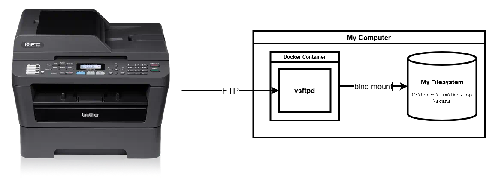
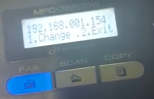

# Brother MFC-7860DW Printer FTP Server



Run an FTP server as a Docker Compose service that is connectable from my printer, a Brother
MFC-7860DW. This printer is quite old but does support FTP transfer of scans. As far as I can tell,
this is the best way to get scans off of it.

This software and documentation are mostly for me, but if it helps anyone else, all the better. This
is a solid machine that I hope to use for years to come.

*Note: The server is based off of
[docker-vsftpd.git](https://github.com/markhobson/docker-vsftpd.git)
but has been edited so that I don't have to commit the secret to version control in the
`docker-compose.yml` file (and to provide some other quality-of-life changes).*

## Steps

1. Clone this repo (and get the git submodule that contains the dockerized vsftpd):

   ```shell
   git clone https://github.com/t-mart/printer-ftp-server.git
   cd printer-ftp-server/
   git submodule init
   git submodule update
   ```

2. Save the username and password of the FTP server in a file in the build context of the server
   image:

   *Note: I keep these in my password manager too.*

   ```shell
   cp docker-vsftpd/virtual_users.template.txt docker-vsftpd/virtual_users.txt
   vi docker-vsftpd/virtual_users.txt  # edit in vi
   ```

   Make sure to follow the format:

   ```text
   username
   password
   ```

   (You can even add more users if you want. Just add more pairs of username/password lines.)

3. Ensure the volume bind source in `docker-compose.yml` exists. Default is
   `C:\Users\tim\Desktop\scans`. Update it if not.

4. Run this docker compose service:

   ```shell
   docker compose up --detach --build --always-recreate-deps  # or simply `make up` if you have make
   ```

5. Create a firewall rule like the following:

   

   The main parts are:

   - Protocols and Ports tab
      - Protocols and Ports section
         - Local port: `Specific Ports` and `20, 21, 21100-21110`
           (20 is for FTP data, 21 is for FTP control, 21100-21110 are for passive mode.)
   - Scope tab
      - Remote IP address section
         - `These IP addresses:`
            - `192.168.1.0/24`, or whatever an appropriate CIDR subnet block would be for the
               network.

6. Find the printer's IP address on the network. This information can be found on the printer itself
   through the LCD display:

   1. Press the `Menu` button.
   2. Press the down arrow until you reach `6. Network`. Press the `OK` button.
   3. Press the down arrow until you reach `2. WLAN`. Press the `OK` button.
   4. The first option should be `TCP/IP`, which is what we want. Press the `OK` button.
   5. Press the down arrow until you reach `2. IP Address`. Press the `OK` button.
   6. Record the displayed IP address.

      


7. Navigate to that IP address in a browser. Then, in the navigational menu, go to:

   1. Administrator Settings
   2. FTP Scan Profile

   *Note: If the administrator username/password are asked for, look for it in my password manager.*

   Then, create a few profiles. Profiles can be selected in the "Scan to FTP" menu on the printer
   and specify some properties of the scan, such as DPI, file type, etc.

   

   Common Parameters:

   - Host Address: IP of my computer (find with `ipconfig`)
   - Username: username from step #2
   - Password: password from step #2
   - Store Directory: `/`
   - Passive Mode: `On`
   - Port Number: `21`

   Profile-specific Parameters:

   - Document scanning:
     - Profile Name: `document`
     - File Name: `scan`
     - Quality: `Color 200`
     - File Type: `PDF`
     - File Size: `Middle`

   - Hi-Res Document scanning:
     - Profile Name: `document-hi-res`
     - File Name: `scan`
     - Quality: `Color 600`
     - File Type: `PDF`
     - File Size: `Large`

   - Photo scanning:
     - Profile Name: `photo`
     - File Name: `scan`
     - Quality: `Color 600`
     - File Type: `PDF`
     - File Size: `Large`

8. Do a test scan to ensure it works. 🤞
