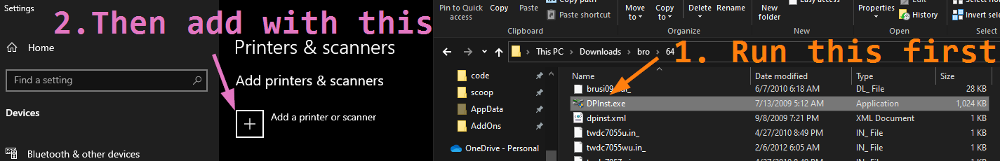

# Printing Setup

Just a few small notes about setting up printing:

- The default Windows driver installation lacks some feature, like duplex printing capabilities.

  Instead, before adding the printer in the Control Panel, run the driver software first, which I
  have included in this repository under [drivers](../drivers/). After decompressing the driver
  files to a directory of your choosing, click the executable in that directory. Note that it
  appears to not do anything -- no interactive screens, etc. _Then_, add the printer in the Control
  Panel.

  

  Then, duplex printing will be available in print dialogs.
