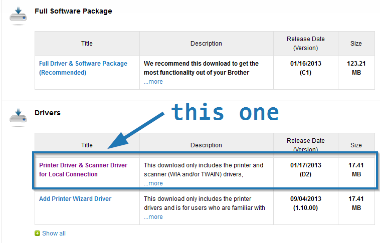

# Printing Setup

Just a few small notes about setting up printing:

- The default Windows driver installation lacks some features, like duplex printing. You gotta use
  the proprietary Brother driver.

  1. Download the latest driver from
     [the printer's download page](https://support.brother.com/g/b/downloadlist.aspx?c=us&lang=en&prod=mfc7860dw_all&os=10013).
     Just get the "Printer Driver & Scanner Driver for Local Connection" because the "Full
     Driver..." has stuff we don't need (bloaty things).

     

     **As a backup, a driver is kept in this repository under [drivers](../drivers/).**

  2. Run this driver executable. The first step will be to decompress its files somewhere. Choose a
     folder and press the button.

     

  3. Run the executable in the extract directory. For me, it was named `DPInst.exe`. Note that it
     appears to not do anything -- there's an administrator prompt and then no interactive dialogs,
     wizard, etc. That's ok.

  4. _Then_, add the printer in the Control Panel. It may take a minute. It should know to use the
     just-installed driver on its own.

     

  5. It's done. Duplex printing will be available in print dialogs.
