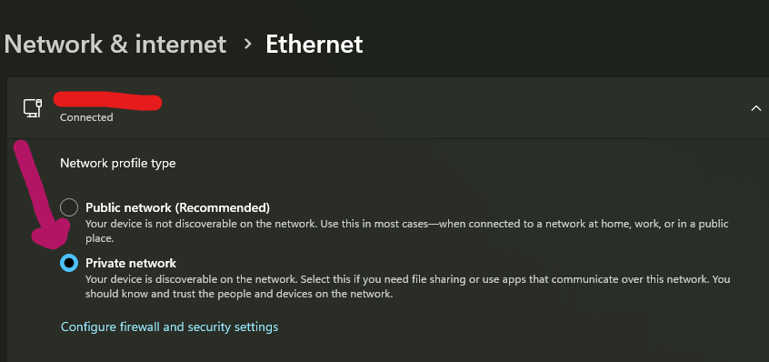
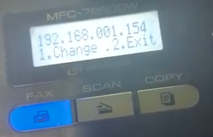
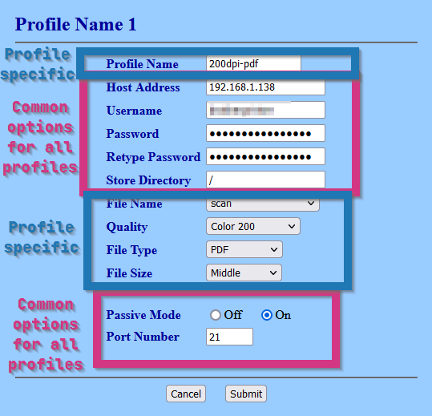
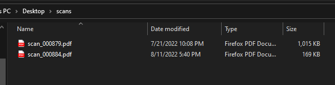

# Scanning Setup

Here, I describe the FTP scanning setup I use. It requires an FTP server to run
on the host machine.

## Features

- Put scanned files immediately on the host system. No email, etc.
- Can be driven entirely from the the printer. Otherwise, you're running back
  and forth to the computer to start additional scans or to the printer to load
  more documents.
- Output PDF and JPEG documents in a variety of DPIs. (This is really a scanner
  feature, but still, I want to be able to access those features from the
  method.)
- Don't use proprietary software that may stop working one day.

## Steps

1. Set up an FTP server. ~~I set this up as a Windows service, so it always runs
   when my computer is on. See documentation for how I do this [here](https://github.com/t-mart/my-nssm-setup#unftp).~~ I now set this up on my home Debian server. See how I do that [here](/docs/ftp-http-server.md).

2. Ensure the network interface mode is set to "private". This will let other hosts (the
   printer) connect without firewall refusal.

   

3. Find the printer's IP address on the network. This information can be found on the printer itself
   through the LCD display:

   1. Press the `Menu` button.
   2. Press the down arrow until you reach `6. Network`. Press the `OK` button.
   3. Press the down arrow until you reach `2. WLAN`. Press the `OK` button.
   4. The first option should be `TCP/IP`, which is what we want. Press the `OK` button.
   5. Press the down arrow until you reach `2. IP Address`. Press the `OK` button.
   6. Record the displayed IP address.

      

4. Navigate to that IP address in a browser (port 80). Then, in the navigational menu, go to:

   1. Administrator Settings
   2. FTP Scan Profile

   **Note to self: If the administrator username/password are asked for, use the values I keep in my
   password manager under `Brother Printer Admin`**

5. Create printer profiles that specify the host FTP server and print quality/output options.

   

   Common Parameters:

   - Host Address: IP of my computer (find with `ipconfig`)
   - Username: anonymous
   - Password: anonymous
   - Store Directory: `/`
   - Passive Mode: `On`
   - Port Number: `21`

   Profile-specific Parameters:

   - Document scanning:

     - Profile Name: `document`
     - File Name: `scan`
     - Quality: `Color 200`
     - File Type: `PDF`
     - File Size: `Middle`

   - Hi-Res Document scanning:

     - Profile Name: `document-hi-res`
     - File Name: `scan`
     - Quality: `Color 600`
     - File Type: `PDF`
     - File Size: `Large`

   - Photo scanning:

     - Profile Name: `photo`
     - File Name: `scan`
     - Quality: `Color 600`
     - File Type: `PDF`
     - File Size: `Large`

6. Do a test scan to ensure it works 🤞. See below.

## Actually scanning stuff

Now, we put our preparation to action. Here's how to scan documents:

1. Pressing the translucent "SCAN" button on the machine.
2. Pressing the down arrow button once so that "Scan to FTP" is showing on the LCD.
3. Press the black circular "OK" button to select it.
4. Using the up/down arrow buttons to cycle through the profiles on the LCD.
5. On the desired profile, press the "OK" button again.
6. Place a document/image on the glass or in the document feeder.
7. Then press the green "Start" button.
8. Once scanning is complete, the document should show up in the scans folder set up previously.

   
