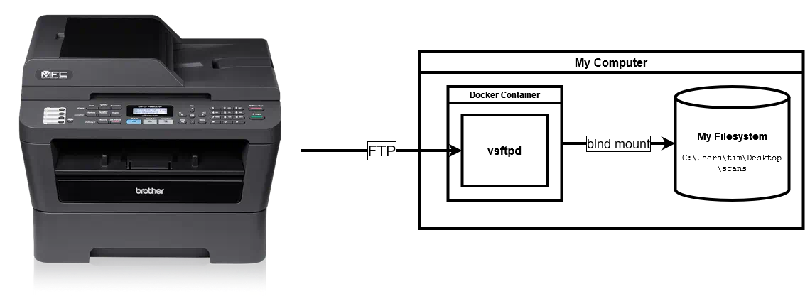
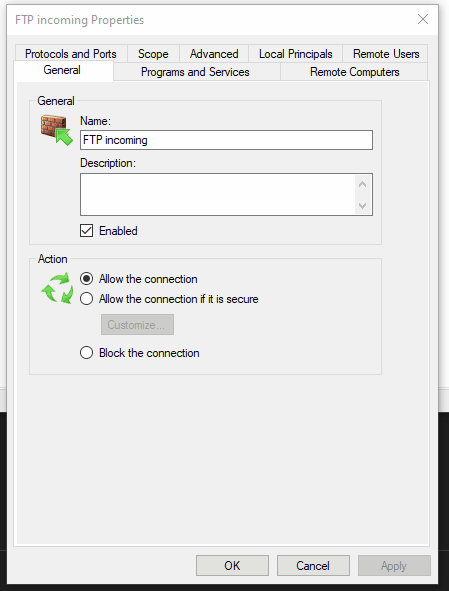

# Scanning Setup

Here, I describe the scanning setup I use. I've done this so many times over the years, and always
forget a detail or two when setting up a new computer or after installation of my OS.

## Goals

- Put scanned files immediately on the host system. No email, etc.
- Can be driven entirely from the the printer. Otherwise, you're running back and forth to the
  computer to start additional scans or to the printer to load more documents.
- Output PDF and JPEG documents in a variety of DPIs. (This is really a scanner feature, but still,
  I want to be able to access those features from the method.)
- Don't use proprietary software that may stop working one day.

## Implementation

The premise of this method is that the scanner can upload files to an FTP server that allows me to
meet the goals above. In this repository, I provide:

- A Docker Compose application that specifies:
  - An FTP server with a decent level of configurability, logging, and security.
    - The server is based off of
      [markhobson/docker-vsftpd.git](https://github.com/markhobson/docker-vsftpd.git), with some
      quality of life improvements.
  - Bind mounting of the FTP server's file storage to a convenient directory on my filesystem.
  - A restart policy of `unless-stopped`. This has Docker bring the application automatically up if
    I restart my my computer.
- Firewall rule (for Windows) setup instructions that permits the incoming connection from the
  printer.



## Steps

1. Clone this repo (and get the git submodule that contains the dockerized vsftpd):

   ```shell
   git clone https://github.com/t-mart/printer-ftp-server.git
   cd printer-ftp-server/
   git submodule init
   git submodule update
   ```

2. Save the username and password of the FTP server in a file in the build context of the server
   image:

   **Note to self: I keep these in my password manager under
   `Brother Printer FTP Account to Desktop`**

   ```shell
   cp docker-vsftpd/virtual_users.template.txt docker-vsftpd/virtual_users.txt
   vi docker-vsftpd/virtual_users.txt  # edit in vi
   ```

   Make sure to follow the format:

   ```text
   username
   password
   ```

   (You can even add more users if you want. Just add more pairs of username/password lines.)

3. Ensure the volume bind source (i.e. the directory it points to) in `docker-compose.yml` exists on
   the host system. Default is `C:\Users\tim\Desktop\scans`. Update it if not.

4. Run this docker compose service:

   ```shell
   docker compose up --detach --build --always-recreate-deps  # or simply `make up` if you have make
   ```

5. Create a firewall rule like the following:

   

   The main parts are:

   - Protocols and Ports tab
     - Protocols and Ports section
       - Protocol Type: `TCP`
       - Local port: `Specific Ports` and `20, 21, 21100-21110` (20 is for FTP data, 21 is for FTP
         control, 21100-21110 are for passive mode.)
   - Scope tab
     - Remote IP address section
       - `These IP addresses:`
         - `192.168.1.0/24`, or whatever an appropriate CIDR subnet block would be for the network.

6. Find the printer's IP address on the network. This information can be found on the printer itself
   through the LCD display:

   1. Press the `Menu` button.
   2. Press the down arrow until you reach `6. Network`. Press the `OK` button.
   3. Press the down arrow until you reach `2. WLAN`. Press the `OK` button.
   4. The first option should be `TCP/IP`, which is what we want. Press the `OK` button.
   5. Press the down arrow until you reach `2. IP Address`. Press the `OK` button.
   6. Record the displayed IP address.

      

7. Navigate to that IP address in a browser (port 80). Then, in the navigational menu, go to:

   1. Administrator Settings
   2. FTP Scan Profile

   **Note to self: If the administrator username/password are asked for, use the values I keep in my
   password manager under `Brother Printer Admin`**

8. Create printer profiles that specify the host FTP server and print quality/output options.

   

   Common Parameters:

   - Host Address: IP of my computer (find with `ipconfig`)
   - Username: username from step #2
   - Password: password from step #2
   - Store Directory: `/`
   - Passive Mode: `On`
   - Port Number: `21`

   Profile-specific Parameters:

   - Document scanning:

     - Profile Name: `document`
     - File Name: `scan`
     - Quality: `Color 200`
     - File Type: `PDF`
     - File Size: `Middle`

   - Hi-Res Document scanning:

     - Profile Name: `document-hi-res`
     - File Name: `scan`
     - Quality: `Color 600`
     - File Type: `PDF`
     - File Size: `Large`

   - Photo scanning:

     - Profile Name: `photo`
     - File Name: `scan`
     - Quality: `Color 600`
     - File Type: `PDF`
     - File Size: `Large`

9. Do a test scan to ensure it works 🤞. See below.

## Actually scanning stuff

Now, we put our preparation to action. Here's how to scan documents:

1. Pressing the translucent "SCAN" button on the machine.
2. Pressing the down arrow button once so that "Scan to FTP" is showing on the LCD.
3. Press the black circular "OK" button to select it.
4. Using the up/down arrow buttons to cycle through the profiles on the LCD.
5. On the desired profile, press the "OK" button again.
6. Place a document/image on the glass or in the document feeder.
7. Then press the green "Start" button.
8. Once scanning is complete, the document should show up in the scans folder set up previously.

   
